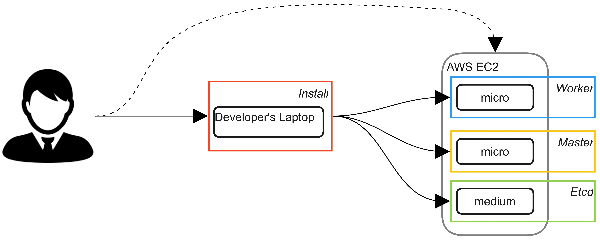
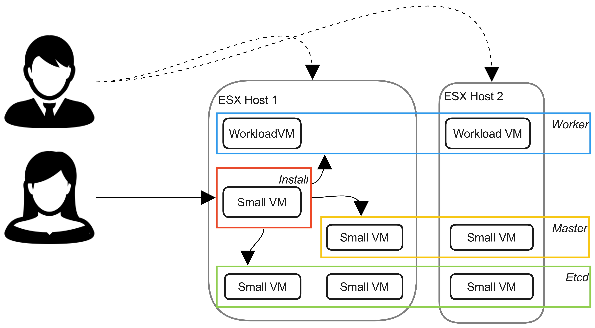

# Cluster Intent

| Why do you want to install Kubernetes? | Example Cluster |
| --- | --- |
| I want to run a small development cluster on my laptop| [Minikube-style](#minikube) |
| I want to run a small protoype or development cluster in AWS | [Developer](#junior) |
| I want to run a reliable, permanent labratory cluster to host mostly services for my team. | [Skunkworks](#skunkworks) |
| I want to run a reliable, permanent production cluster to host services for my team and others. | [Production](#production) | 

# Minikube style

*Just heard about Kubernetes. Love Docker and want to see what the fuss is about.*

What you need:

* A developer's laptop (Running OSX or Linux)
* A desktop virtualizer (such as Oracle VirtualBox)
* A VM lifecycle tool (such as Vagrant) can dramatically speed up set up time

How you install:
1. Download the [latest Kismatic](PROVISION.md#get) for your OS and unpack it somewhere convenient.
2. Create a [small Linux VM](PLAN.md#compute)
   1. You will need to know its IP address and short name.
   2. You will need to create a user with passwordless auth, ssh capability and a [public key](PROVISION.md#access).
3. Run `kismatic install plan`; you will be creating 1 of each node
4. Open the plan file in a text editor
   1. Update your user and public key if necessary
   2. Add your one machine's IP and short name as a node in the section for each type of node -- etcd, worker and master.
5. Run `kismatic install apply`
6. Congratulations! You have your first cluster.

# 1/1/1+ Developer's Cluster

*I'm loving the Kubernetes and want to share it with the rest of my team, maybe give them each their own little cluster to play with.*

What you need:

* A developer's laptop (Running OSX or Linux)
* An AWS account

How you install:

# 3+/2/2+ Skunkworks Cluster

*I would like to build and grow a big cluster for my team to share and work with. I don't need to share much with other people in the company, want to avoid introducing complexity to our network or I prefer the security of not having all of my Kubernetes pods addressable automatically by anybody with access to the network. This is a production environment, but we can probably survive a major disaster so long as it is low risk.*

What you need:

* An AWS account, bare metal machines or a bunch of VMs

How you install:
1. Make an install machine. This is a small (1 CPU, 1 GB ram, <8 GB hard drive) Linux VM with an encrypted disk and very limited access -- just potential cluster administrators.

# 5+/2+/2+ Production Cluster

*I want to build and grow a big cluster for my team to share their apps with the rest of the company. Security is a secondary concern to access. Also, this is production: we can't take any chances.*

What you need:

* Bare metal machines or a bunch of VMs

How you install:
1. Make an install machine. This is a small (1 CPU, 1 GB ram, <8 GB hard drive) Linux VM with an encrypted disk and very limited access -- just potential cluster administrators.
